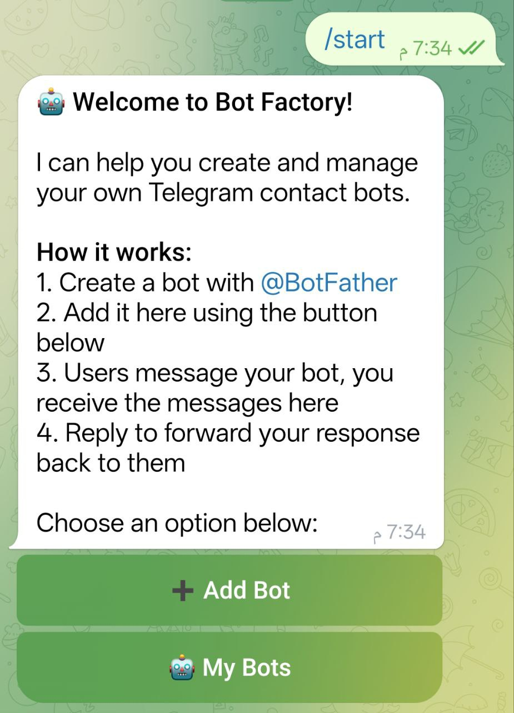
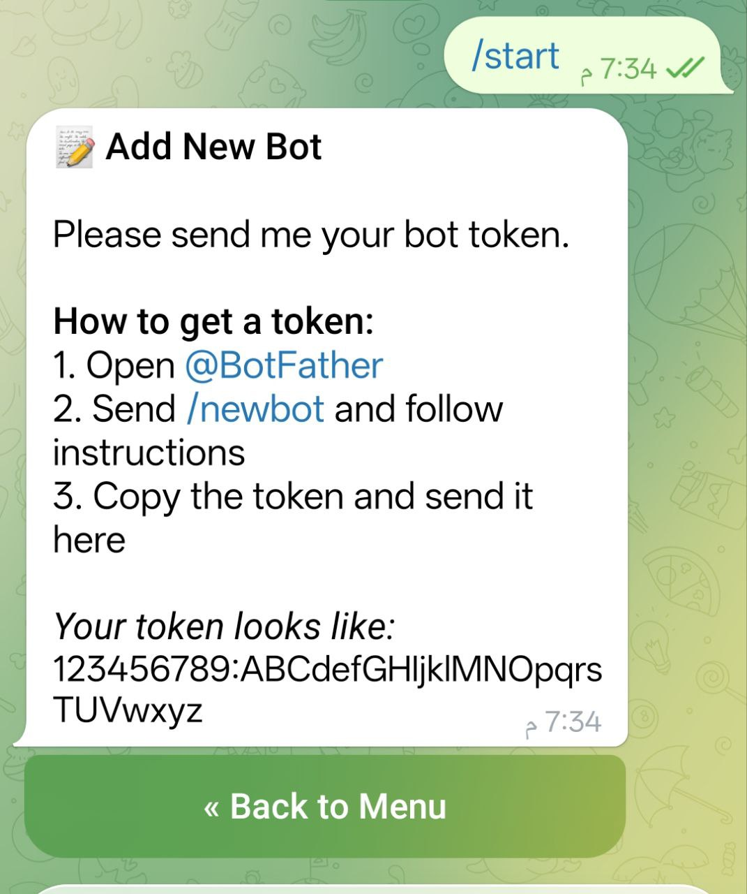
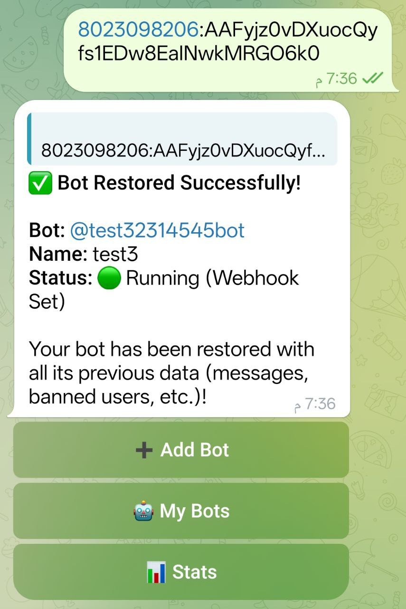
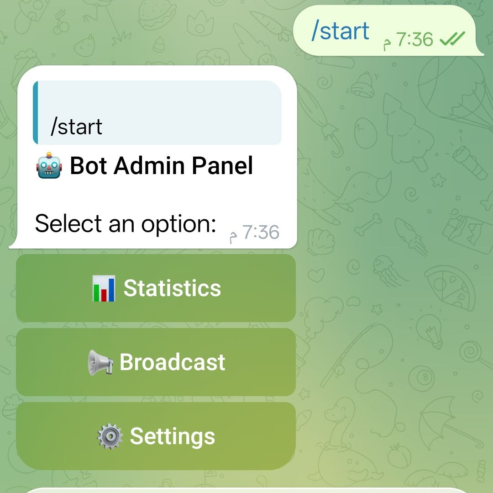
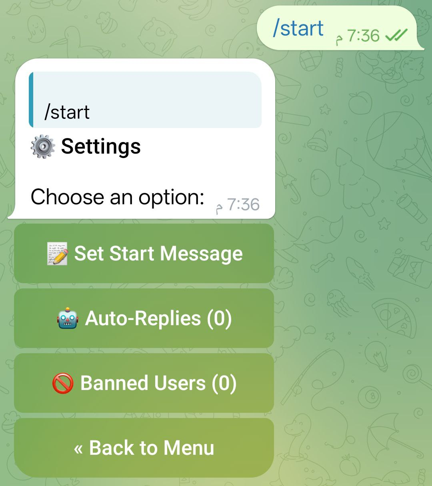
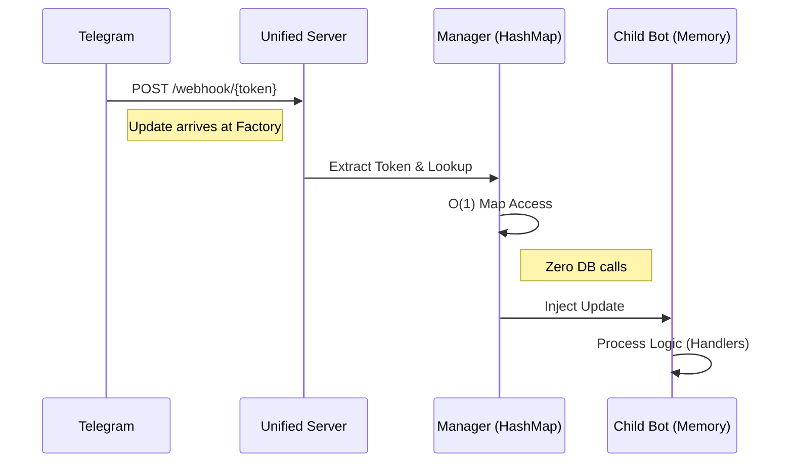

# BotForge - Telegram Communication Bot Factory

> 🤖 **Live Demo**: Try it now at [@BotForge1bot](https://t.me/BotForge1bot)

BotForge is a scalable, high-performance **Communication Bot Factory** developed in **Go**. It enables users to instantly create their own **customer support & communication bots** through a master "Factory Bot" — no coding required!

### 💬 What Does It Do?
BotForge lets you create your own **personal communication bot**. Instead of sharing your phone number or chatting directly with people, they message your bot — and you reply through the bot. Simple!

**Example**: Someone wants to contact you → They find your bot → Send a message → You receive it and reply — all through the bot, no personal contact needed.

### 📸 Screenshots

<table>
  <tr>
    <td align="center"><br/><b>Welcome Screen</b></td>
    <td align="center"><br/><b>Add New Bot</b></td>
    <td align="center"><br/><b>Bot Added Successfully</b></td>
  </tr>
  <tr>
    <td align="center"><br/><b>Bot Admin Panel</b></td>
    <td align="center"><br/><b>Bot Settings</b></td>
  </tr>
</table>

## ⚡ Technical Architecture (Deep Dive)

BotForge is engineered for extreme scalability and efficiency, departing from the traditional "process-per-bot" or "long-polling" models. Instead, it utilizes a **Single-Instance Webhook Architecture**.

### 📊 Architecture Comparison

| Feature | Traditional Bots | 🚀 BotForge |
| :--- | :--- | :--- |
| **Server Cost** | High (1 Process/Bot) | **Low (1 Process/All)** |
| **Routing Speed** | Slow (Database Query) | **Instant (O(1) Memory)** |
| **Port Usage** | 1 Port per Bot | **1 Port Total** |
| **Scalability** | Linear (Hard Limit) | **Infinite** |

### 🔄 Request Lifecycle (Sequence Diagram)



### 1. Unified HTTP Server (The Gateway)
- **Single Port Entry**: The application exposes a single HTTP server (default port `4210`).
- **Universal Handler**: This server acts as the funnel for *all* Telegram updates, whether for the Factory Bot or any of the thousands of Child Bots.
- **Smart Pathing**: Telegram sends updates to `/webhook/{BOT_TOKEN}`. This path design allows the server to instantly identify the target bot without parsing the payload first.

### 2. O(1) In-Memory Routing
- **Zero Database Hit**: When a webhook request arrives, the `Manager` extracts the `token` from the URL.
- **HashMap Lookup**: It performs an instantaneous O(1) lookup in a thread-safe in-memory map to retrieve the `*telebot.Bot` instance.
- **Direct Injection**: The update payload is then directly injected into that specific bot's logic pipeline. This ensures that processing latency remains constant (microseconds) regardless of whether you have 10 or 10,000 bots.

### 3. Custom `ManualPoller` Technology
- **Resource Efficiency**: Standard libraries often spawn internal servers or polling loops for each bot. BotForge uses a custom `ManualPoller` implementation.
- **Passive Bots**: Child bots are initialized in a "passive" state. They do not open ports or unauthorized connections. They simply wait for the Manager to "feed" them updates.
- **Memory Footprint**: This approach drastically reduces the memory footprint. A child bot is essentially just a struct in memory with some registered handlers, consuming negligible RAM.

### 4. Robust Security Architecture
- **At-Rest Encryption**: Bot tokens are the keys to the kingdom. We store them using **AES-256 (GCM Mode)** encryption in MySQL. Even if the database is compromised, the tokens are useless without the factory's private encryption key.
- **Obscured Webhooks**: By using the Bot Token as part of the webhook URL (e.g., `.../webhook/123:AbCd...`), the URL essentially becomes a shared secret between your server and Telegram. It is mathematically impossible for an attacker to guess the webhook URL to spoof updates.


## 🚀 Key Features

- **Factory Pattern**: A single master bot (Factory Bot) manages the creation and lifecycle of limitless child bots.
- **Webhook Architecture**: Uses a single HTTP server to handle webhooks for ALL bots (Factory + Children), eliminating the need for long-polling or multiple port bindings.
- **Redis Caching**: High-performance caching for sessions and states using Redis.
- **MySQL Persistence**: Robust data storage for bot configurations and user data.
- **Secure**: All bot tokens are encrypted at rest using AES encryption.
- **Admin Panel**: Built-in administration tools for managing the factory.

## 🛠 Tech Stack

- **Language**: Go 1.22+
- **Framework**: [Telebot v3](https://gopkg.in/telebot.v3)
- **Database**: MySQL 8.0+
- **Cache**: Redis 6+
- **Routing**: Standard `net/http` with custom path routing.

## 📂 Project Structure

```bash
BotForge/
├── cmd/server/       # Entrypoint (main.go)
├── internal/
│   ├── bot/          # Bot Manager & Handler Logic
│   ├── config/       # Configuration loading
│   ├── database/     # DB Connection & Repository
│   ├── factory/      # Factory Bot Business Logic
│   ├── models/       # Data Structures
│   └── utils/        # Crypto & helper functions
├── .env.example      # Template for environment variables
```

## ⚙️ Configuration

Copy `.env.example` to `.env` and configure the following:

```ini
# Factory Bot Token (From @BotFather)
FACTORY_BOT_TOKEN=123456:ABC-DEF1234ghIkl-zyx57W2v1u123ew11

# Admin ID (Your Telegram User ID)
ADMIN_ID=123456789

# Webhook Settings
WEBHOOK_URL=https://your-domain.com
PORT=4210

# Database (MySQL)
DB_HOST=127.0.0.1:3306
DB_USER=root
DB_PASS=password
DB_NAME=BotForge

# Redis
REDIS_ADDR=127.0.0.1:6379
REDIS_PASSWORD=
REDIS_DB=0

# Security (Must be exact 32 chars)
# Generate with: openssl rand -hex 16
BOT_ENCRYPTION_KEY=00000000000000000000000000000000
```

## 📦 Installation & Setup

1.  **Clone the repository**:
    ```bash
    git clone https://github.com/your-username/BotForge.git
    cd BotForge
    ```

2.  **Setup Database**:
    Import the schema into your MySQL database:
    ```bash
    mysql -u root -p BotForge < migrate_schema.sql
    ```

3.  **Install Dependencies**:
    ```bash
    go mod tidy
    ```

4.  **Build**:
    ```bash
    go build -o BotForge ./cmd/server
    ```

## 🚀 Running the App

Run the compiled binary:
```bash
./BotForge
```

The server will start listening on the specified `PORT` (default 4210).
Ensure your `WEBHOOK_URL` points to this server (e.g., via Nginx or Cloudflare Tunnel).

### Nginx Configuration Example

```nginx
server {
    listen 443 ssl http2;
    server_name your-domain.com;

    location /webhook/ {
        proxy_pass http://127.0.0.1:4210;
        proxy_set_header Host $host;
        proxy_set_header X-Real-IP $remote_addr;
    }
}
```

## 🛡️ Security

- **Token Encryption**: Child bot tokens are never stored in plain text. They are encrypted using the `BOT_ENCRYPTION_KEY`.
- **Private Webhooks**: Webhook paths are randomized using the Bot Token itself, so they cannot be guessed.

